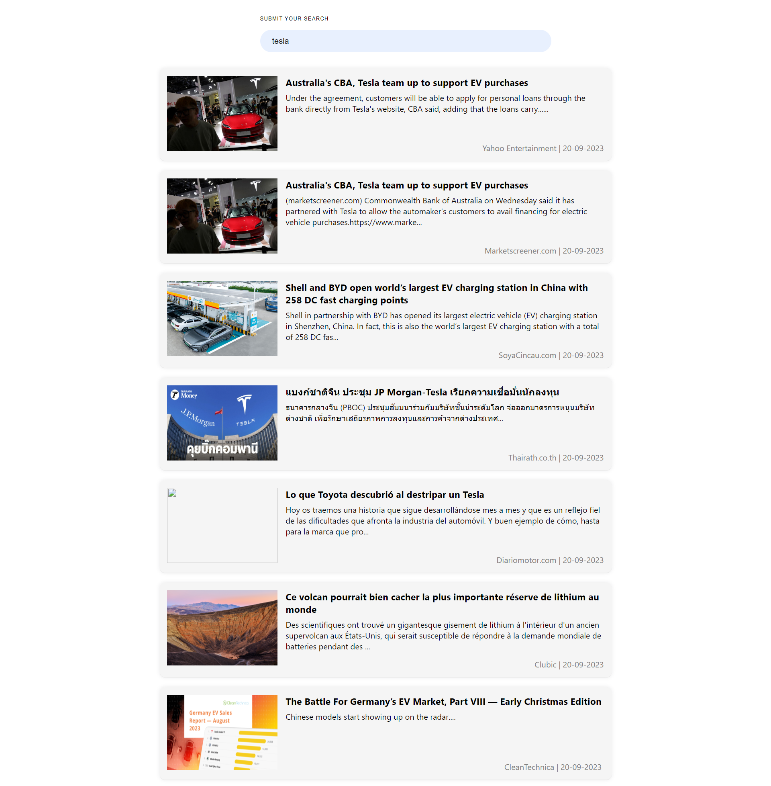

# React infinite scroll demo

This infinite scroll in implemented from scratch using `IntersectionObserver` apis, not third party library is used while implementing this project

# How to Run 
## Run Using local node Environment
- Step 1 : Clone  the repo to your workspace

- Step 2 : Rename the `.env.example` to `.env`

- Step 3 : Go to [https://newsapi.org]() and generate your api key

- Step 4 : Replace the `xxxxxxxxxxxxxxxxxxxxxx` with your api kay

- Step 5 : Run command 
  ```sh
  npm i
  ``` 

- Step 6 : Run command `npm start`

- Step 7 : Go to [http://localhost:3000]()
 
<!-- ## Run Using Docker

- Step 1 : Go to [https://newsapi.org]() and generate your api key

- Step 2 : Run command
  ```sh
  docker run -e REACT_APP_API_KEY=your_api_key -p 3000:3000 <Image Name> 
  ``` 

- Step 3 : Go to [http://localhost:3000]() -->

# Demo
## [Video Demo](screenshot/v1.mp4)


